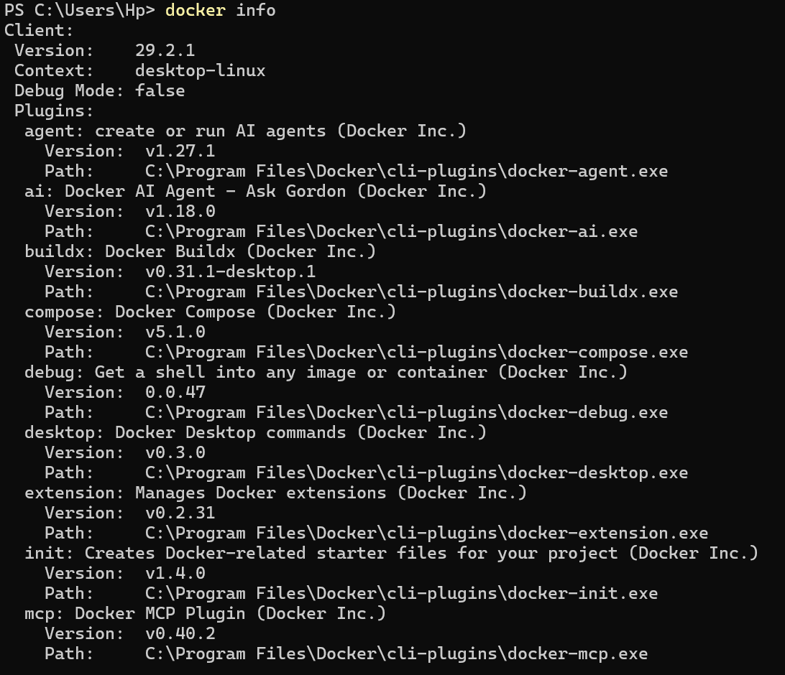
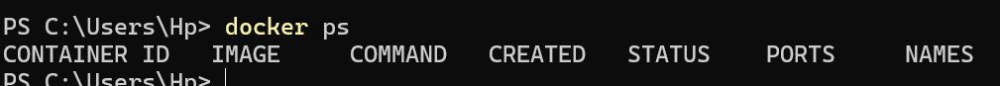
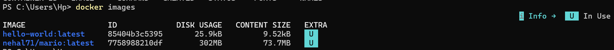
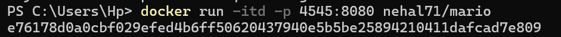
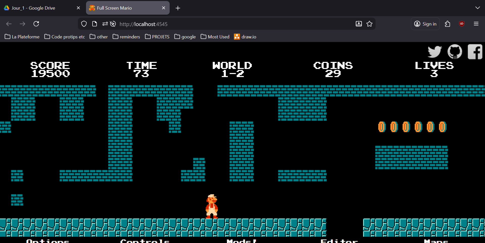
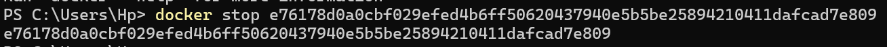
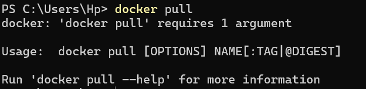

# Exercices welcome-to-docker

docker --version

docker info

docker ps (aucune image active)

docker images

docker run (+ nom de l'image + tags)

(image du jeu actif)

docker stop (+ id ou nom du container)

docker pull (doit avoir le nom de l'image)

docker images liste les images disponibles mais ne permet pas de les récupérer

Pour arrêter l'image il faut utiliser docker stop (nom du container)

Pour supprimer un container : docker rm (nom du container)
Pour supprimer une image : docker rmi (nom de l'image)

Pour supprimer plusieurs containers : docker rm (nom de tous les containers à supprimer séparé par
des espaces)

Pour supprimer les container arrêtés : docker container prune
Pour forcer la suppression d'un container : docker rm -f (ou --force)
Pour supprimer une image : docker rmi (nom de l'image)
Pour supprimer plusieurs images : docker rmi (nom de chaque image à supprimer)
Pour supprimer images inactives : docker image prune
Pour forcer la suppression d'une image : docker rmi -f

>erreur : il est demandé deux fois de donner une commande pour supprimer une image non utilisée
>erreur : docker images ne récupère pas d'images mais liste celles qui sont déjà récupérées et disponibles