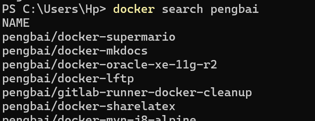
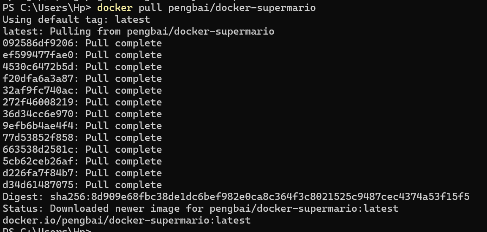

# Readme pour job03

Note: le docker ne se nomme pas "pengbai/supermario" mais "pengbai/docker-supermario"

Pour obtenir cette image on utilise docker pull pengbai/docker-supermario

Pour démarrer l'image on utilise :
docker run -itd -p 8600:8080 pengbai/docker-supermario