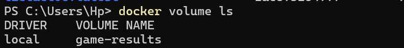
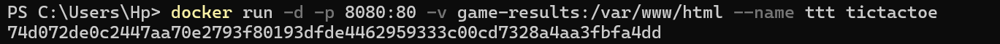
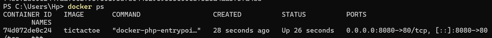
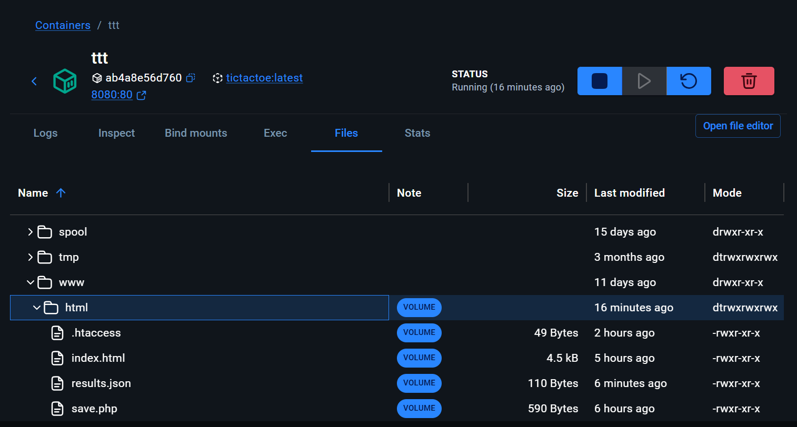

Capture d'écran de la commande docker images :

Commande docker volume create game-results :

Commande docker volume ls :

Commande docker run : 

Commande docker ps : 

Screenshot du jeu dans le navigateur :

Screenshot du contenu du container dans la console :

Screenshot du contenu du container dans Docker Desktop :

Screenshot du contenu du volume dans Docker Desktop : 
