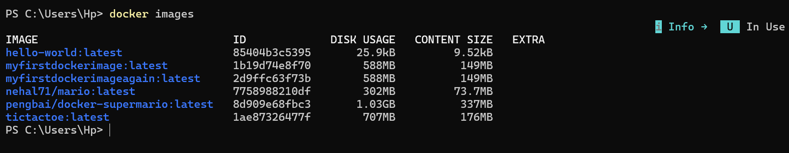
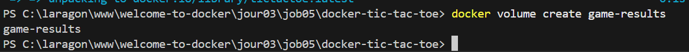
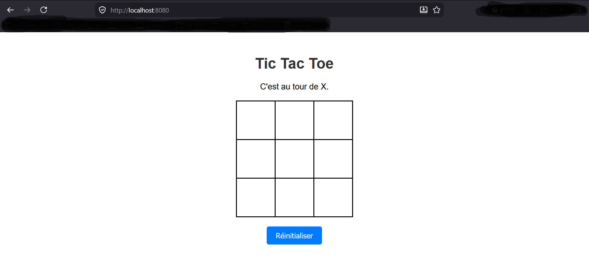
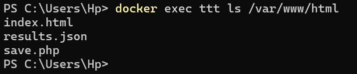
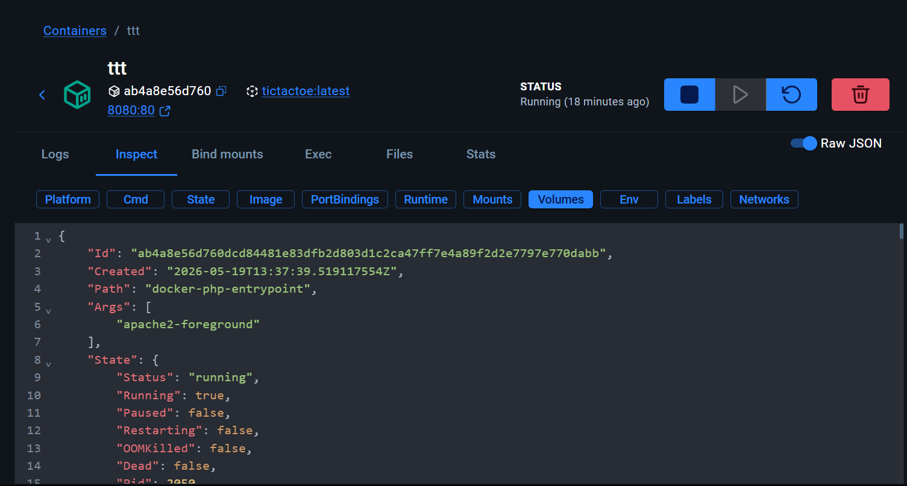

# Docker : Tic Tac Toe

## Etape 3 : Construction de l'image

Capture d'écran de la commande docker images :

## Etape 4 : Créer le volume

Commande docker volume create game-results :

Commande docker volume ls :

## Etape 5 : Lancer le conteneur

Commande docker run : 

Commande docker ps : 

Screenshot du jeu dans le navigateur :

## Étape 6 : Inspecter le conteneur et le volume

Screenshot du contenu du container dans la console :

Screenshot du contenu du container dans Docker Desktop :

Screenshot du contenu du volume dans Docker Desktop : 
